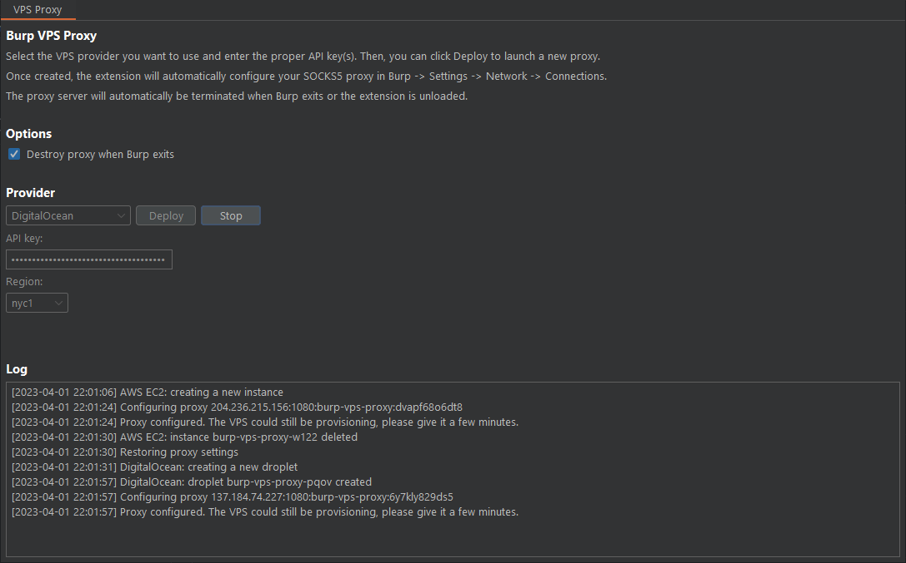
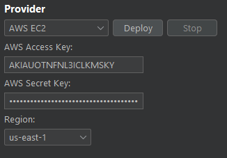

<p align="center">
    
    
    <a href="https://twitter.com/d3mondev"></a>
</p>

<p align="center"></p>
<p align="center">
    <span style="font-size: 24px">Burp VPS Proxy: Easy Cloud Proxies for Burp Suite</span>
    <br />
    <a href="#how-to-use"><strong>Getting Started »</strong></a>
    <br />
    <br />
    <a href="#features">Features</a>
    ·
    <a href="#providers">Providers</a>
    ·
    <a href="#disclaimers--license">Disclaimers</a>
</p>

# About

Burp VPS Proxy is a BurpSuite extension that allows the automatic creation and deletion of upstream SOCKS5 proxies on popular cloud providers from within BurpSuite. It will automatically configure Burp to use the proxy created so that all outbound traffic comes from a cloud IP address. It's useful to prevent our main IP address from getting blacklisted by popular WAFs while doing pentesting and bug bounty hunting.

Burp VPS Proxy was inspired by @honoki's awesome [DigitalOcean Droplet Proxy for Burp Suite](https://github.com/honoki/burp-digitalocean-droplet-proxy) idea.

# Features

* Automatic creation, configuration and deletion of upstream SOCKS5 proxy on popular cloud services from within BurpSuite.
* Support for multiple providers: AWS, Digital Ocean and Linode.
* Each provider has its unique settings, including region selection.
* Automatically destroy the proxy when closing Burp or unloading the extension, with the option to preserve the proxy across sessions instead.
* When the proxy is destroyed, restore SOCKS5 proxy settings in Burp to their original values.
* Compatibility across multiple devices, ensuring seamless use without interference from proxies generated on separate computers.

# How to use

Visit the [release page](https://github.com/d3mondev/burp-vps-proxy/releases) and download the latest `burp-vps-proxy.jar` file.

In BurpSuite's extension tab, visit the Extensions tab and click Add. Set the extension type to Java, and select the `burp-vps-proxy.jar` file.

Once loaded, access the extension via the new VPS Proxy tab in Burp. Select your provider, set your API keys and click Deploy.

# Providers

## Amazon Web Services (AWS)



The extension will use the t4g.nano instance type to minimize costs. Note that not all regions support this instance type.

You will need an AWS Access Key and AWS Private Key in order to configure the extension.

You'll also need to ensure the key pair gives access to at least the following permissions:

```
{
    "Version": "2012-10-17",
    "Statement": [
        {
            "Sid": "EC2Permissions",
            "Effect": "Allow",
            "Action": [
                "ec2:RunInstances",
                "ec2:TerminateInstances",
                "ec2:DescribeInstances",
                "ec2:DescribeImages",
                "ec2:DescribeRegions",
                "ec2:CreateTags",
                "ec2:CreateSecurityGroup",
                "ec2:DescribeSecurityGroups",
                "ec2:AuthorizeSecurityGroupIngress"
            ],
            "Resource": "*"
        }
    ]
}
```

## Digital Ocean


Digital Ocean is a popular VPS provider among security researchers, pentesters and bug bounty hunters. If you don't already have an account, you can get a $200 in free credits by using my referral link to signup:

[](https://www.digitalocean.com/?refcode=e4681a7c61c6&utm_campaign=Referral_Invite&utm_medium=Referral_Program&utm_source=badge)

You will need to create an API key and enter it in the Burp VPS Proxy extension.

Provisioning can take some time after the droplet is created. Wait a few minutes after the instance is up.

# Disclaimers & License

The author and contributors of this extension expressly disclaim any liability for any costs, damages, or consequences resulting from the use of cloud providers in connection with this software.

Using this program for unauthorized or illegal activities, including attacking targets without consent, is strictly prohibited. Users must comply with all applicable laws and regulations. The developer and contributors assume no liability or responsibility for any misuse, damage, or harm caused by this software. It is the user's responsibility to utilize this program in an ethical and lawful manner.

This repository's content is licensed under the GNU General Public License v3.0 (GPLv3).